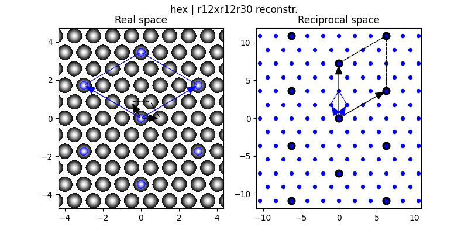
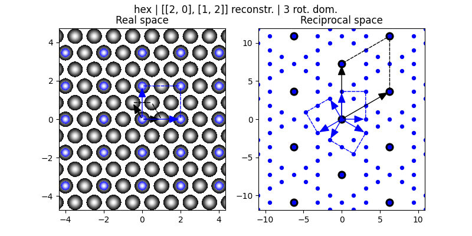

# LEEP

Usage:

```sh
./leep.py -h
usage: leep [-h] [-b BASE | -v X1 Y1 X2 Y2 | -s SPECIAL] [-w WOODS]
            [-m A11 A12 A21 A22] [-r ROTATIONS] [--realsize REALSIZE] [-p]
            [-o fname] [-a]

leep.py visualizes reconstructions. If -b and -v are bothnot given, it assumes
a square unit mesh

optional arguments:
  -h, --help            show this help message and exit
  -b BASE, --base BASE  Real space base. Either one of
                        'hex,square,rect,centered,oblique'.
  -v X1 Y1 X2 Y2, --vectors X1 Y1 X2 Y2
                        Explicit base vectors explicitly (instead of 'BASE').
  -s SPECIAL, --special SPECIAL
                        Special cases instead of a bravais base or custom
                        vectors.
  -w WOODS, --woods WOODS
                        A reconstruction in wood's notation, e.g. 'c(2x2)'or
                        'sqrt3xsqrt3 R30' or '2x1'.
  -m A11 A12 A21 A22, --matrix A11 A12 A21 A22
                        A reconstruction in matrix notation.
  -r ROTATIONS, --rotations ROTATIONS
                        Number of rotational domains. Applies to all defined
                        reconstructions.If r is 2, the domain is mirrored at
                        the h=k=1 direction
  --realsize REALSIZE   Size of real space pattern
  -p, --mirror          Show mirror domains.
  -o fname, --output fname
                        Save image file.
  -a, --showall         show all domains in real space
```

# Examples

### Woods notation: $(2\sqrt{3}\times2\sqrt{3})\text{R}30\degree$

```
./leep.py -b hex -w r12xr12r30
```



### Matrix notation $\bigl(\begin{smallmatrix} 2 & 0 \\ 1 & 2 \end{smallmatrix}\bigr)$ with three rotational domains

```
./leep.py -b hex -m 2 0 1 2 -r 3 -o doc/2012.png
```




<!-- equations by https://www.codecogs.com/eqnedit.php -->
